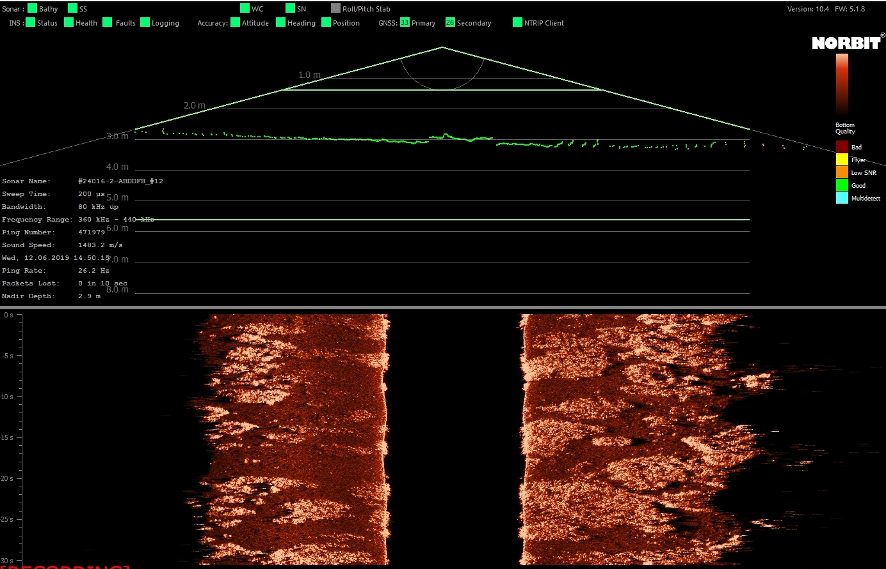

# Seagrass meadows Baltic Sea
Seagrass meadows are one of the most important habitats on the globe. In the Western Baltic Sea
the seagrass Zostera marina is reported all over the place near the coast. Its occurence has considerably decreased 
from 17 m water depth to only 8-9 m water depth today. Eutriphication, algae growth, and thus light limitations is expected the main reasons. 

## Zostera marina 
The sample area is from Flensborg to Kiel / Heidkate covering water depths around 5-8m

## Raw data multibeam snippets data pattern

## Geo-bioacoustic and/or opto-bio properties
Zostera marina min. water depth: 1.5m
Zostera marina max. water depth: 8m
Zostera marina substrate: sand, silt
Zostera marina sediment penetration: 0.3m
Zostera marina canopy height: 1m
Zostera marina diameter leaf: 1-6mm
Zostera marina color: green
Zostera marina season: perannual, predominantly in months 5-11

Has void spaces for buyoncy in leaves
Can produce oxygen, possibly free gas phase
Can be overgrown with red algae
Does not like freshwater
Shoots rise in June
Can settle on sand and silt of very little thickness
Some leaves can remain throughout the year
Can migrate 0.1/y through rhizomes
Can sexually reproduce and spread seeds 

## Ground Truthing Data
### Geology
Video Transects performed by LLUR (Submaris), visual detections e.g. seagrass on bright sand, stones, overgrown stones. 

### Biology
Video Transects performed by LLUR (Submaris), visual detections e.g. seagrass on bright sand, stones, overgrown stones.

*Images taken during our cruise with RV Littorina June 2019*

## Remote Sensing Data

### Spaceborne
Analyses of time-lapse spaceborne images taken in our Study site showed that the visibility through water of the Baltic Sea turned out to be better than expected. Though, we found it to be extremely variable depending on the weather and wind situation some days before the spaceborn picture was taken. E.g. by visual inspection sand bars could be clearly disciminated against areas populated with submerged aquastic vegetation until a water depth of 5m. If groundtruth data is available the dark patches can be mapped to seagrass meadows. A pure spectral discrimination of the seagrass Zostera marina is critical, at least when considering the spectral bands of Sentinel. Nontheless, some meaningful indices from multispectral considerations may be applicable to improve spaceborn mapping from space. How reliable such optical determination of Zostera marina performs on darker substrate with higher mud content remains to be evaluated. 
With ever increasing improvments in spatial and spectral resolutions resolution modern satellites provide 

### Airborne

### Vessel-born acoustic 

## Seasonality

## Repeatable Description of Processing Steps

## Example Data

## References

---

---
