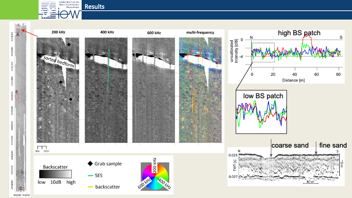

# Create multispectral backscatter mosaics


The ability to create multi-spectral backscatter mosaics has been included in many commercial software packages, including FMGT (https://confluence.qps.nl/fledermaus7/how-to-articles/how-to-fmgt/how-to-fmgt-multi-spectral-backscatter-processing) or SonarWiz.

However, the process is relatively straightforwards using open source utilities.

In the following, we download a dataset from https://www.dropbox.com/sh/80omr76fyo1b1i4/AACEAKTIOkOy-ctEXi8mwCnHa?dl=0 , including a two frequency dataset. Of course, three frequencies can also be easily composite to a multi-spectral RGB image. 

The files can be manually processed, following the description in the other tutorials. Alternatively, the following config file can be used with the script PROCESSING_MBSYSTEM.py (in the Code repository of this git). 

To create a mosaic of the 400 kHz data, edit the file mbsystem_config.py to have thefollowing values:

```
##############################################################
# LEVEL 1: IMPORT AND BASIC CORRECTIONS
##############################################################
# Control which levels are worked on
LEVEL1 = 'yes'
LEVEL2 = 'yes'
LEVEL3 = 'yes'

remove_lock_files = 'yes' 
PFAD = './../../ATLAS/data/400/'   # end with / . CHange if you stored data elswhere
rekursive_directory_search = 'no'
PREPROCESS = 'yes'
FORMAT = 89  # for s7k files
file_end = '.s7k'
SS_FORMAT = 'C'  # C to read field 7058 in s7k. S to read field 7028 
AREA = '12.1053/12.11422/54.1844/55.189965'
GENERATE_DATALIST = 'yes'
AUTO_CLEAN_BATHY = 'yes'
auto_clean_with_area_boundaries = 'yes'
ATTITUDE_LAG = ''
SELECT_SVP = '' 
SVP = ''           
CORRECT_HPR=''
ROLL_CORR = 0.00
PITCH_CORR = 0.00
CORRECT_TIDE = ''    
TIDEFILE = '' 
CORRECT_DRAFT = 'yes'
DRAFT_CORR = 0.4
EXPORT_NAV = 'no'       
EXPORT_INFO_LEVEL1 = 'no'
##############################################################
# LEVEL 2: Correct Backscatter Data
##############################################################
EXPORT_ARC_CURVES = 'no'
PROCESS_SCATTER = 'yes'  
CONSIDER_SEAFLOOR_SLOPE = ''
AVERAGE_ANGLE_CORR = 'yes' 

SSS_ACROSS_CUT = 'yes'
SSS_ACROSS_CUT_MIN = -20
SSS_ACROSS_CUT_MAX = 20

SSS_CORRECTIONS = 'yes' 
SSSWATHWIDTH = 160  
SSINTERPOLATE = 2
EXPORT_INFO_LEVEL2 = 'no'
##############################################################
# LEVEL 3: Make grid data
##############################################################
SCATTER_FILTER = 'low'      
INTERPOLATION = '-C3/1'   

## Grids
WORK_ON_PER_FILE_BASIS = 'no'  

# Work for both on a per-survey and per file setting
GENERATE_BATHY_GRIDS = 'yes'
GENERATE_SCATTER_GRIDS = 'yes'
SCATTER_WITH_FILTER ='yes'   #Export filtered grids
EXPORT_XYI_FROM_GRID = 'no'
BATHY_RES = '-E1/1'
SCATTER_RES = '-E0.25/0.25'

# convert Grids
UTM_Convert = 'no'
ZONE = '-JU'   

#Only for work on a per-file bases
EXPORT_BEAM_ANGLE = 'no'    
EXPORT_XYI = 'no'           
EXPORT_XYZ = 'no'
KFAKTOR = 50               

FORCE_MBPROCESS = 'no'   
number_of_exceptions = 0

```

Then, execute the file 
`python PROCESSING_MBSYSTEM.py`

which will generate a sss_grid_filtered.grd file in the 400 kHz folder. Repeat the steps for the 700 kHz folder by adapting the path correspondingly.

To combine the two grids into a multispectral tif, convert the two grid files to grayscale georeferenced tif images and copy the results in one common folder. 

`gmt grdimage sss_grid_filtered.grd -A400.tif -Cgray`
`gmt grdimage sss_grid_filtered.grd -A700.tif -Cgray`

These two images can now be combined to a multispectral image using gdal. 

```
gdalbuildvrt -separate RG.vrt A400.tif A700.tif
gdal_translate RGB.vrt RG.tif
```

_Example of a multspectral images in the North, plotted with a dynamic range of 10dB. Note the different snesitivites to small changes in the different frequencies, and the higher relative backscatter intensitiy of coarse material surrounding a sorted bedforms in high frequencies_


_Example of a seafloor patch showing higher backscatter intensity compared to its surroundings in low frequenciey, and reduced intensity at high frequency._